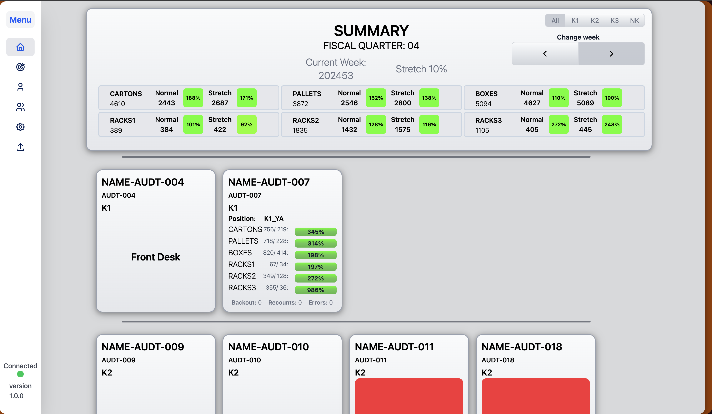
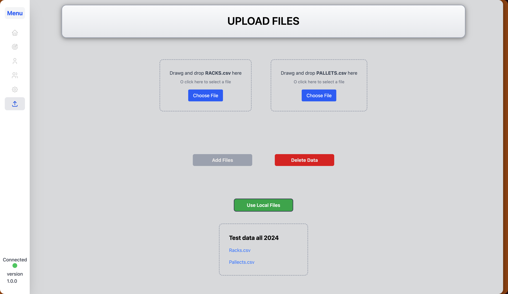
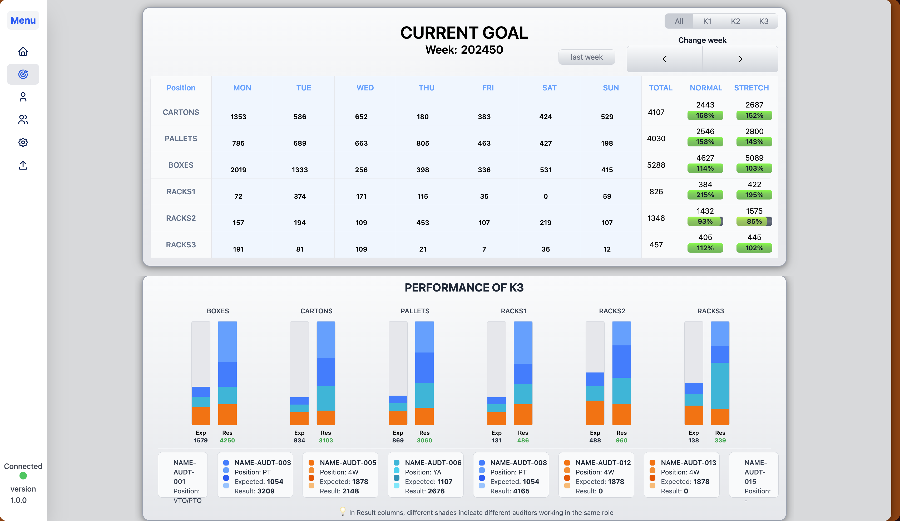
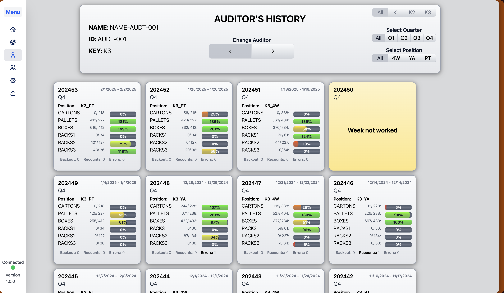
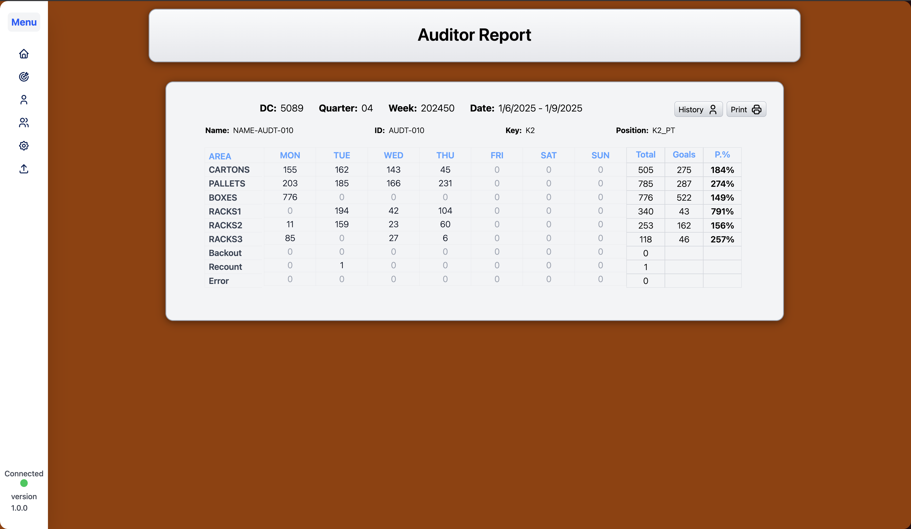
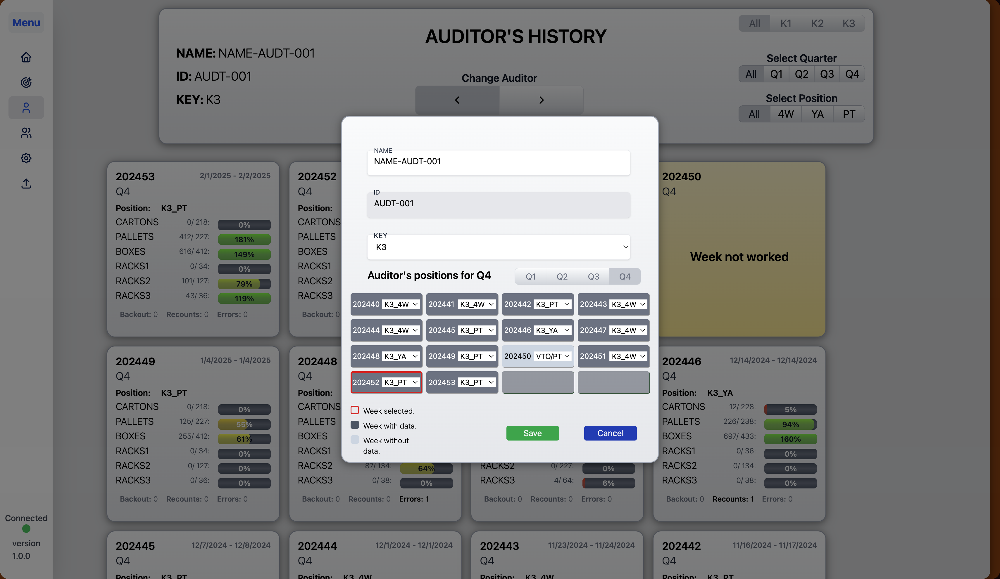
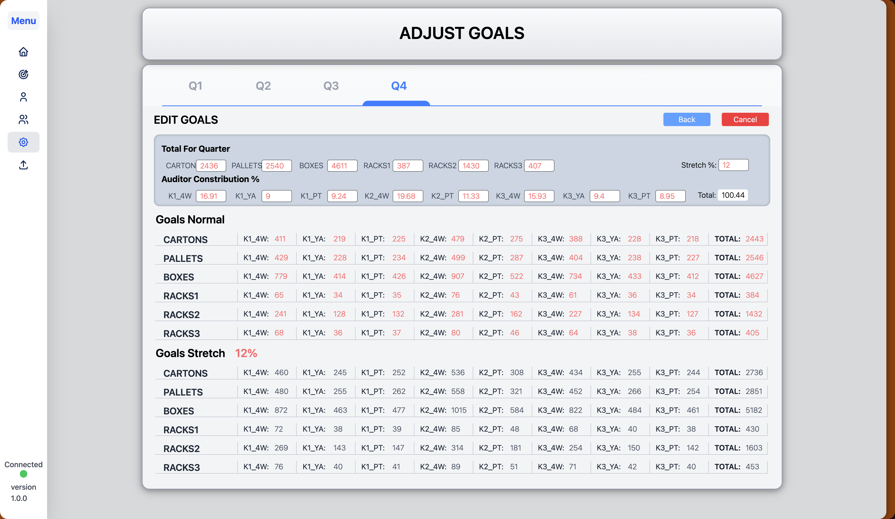

# Asset Protection Goal Tracking

 

**[View Project Preview](https://auditor-report-static.vercel.app/#/load_file)**

## 📊 Project Overview

A data reporting and process-improvement project created to make **Asset Protection goal tracking more reliable, consistent, and repeatable**.

The project started with a simple problem: the team depended on a Tableau report that was updated by a third party, which made it difficult to know when the data had been refreshed. Reviewing and preparing the numbers also required manual work in Excel.

I used **Excel and Power Query** to transform the raw data into a repeatable reporting process that allowed the team to view overall goals, weekly performance, and individual goals in one place.

---

## 🎯 Business Problem

When I started working in Asset Protection, I noticed that tracking our goals was difficult and sometimes inaccurate.

The team depended on a Tableau table maintained by a third party, so we did not have control over when the data was refreshed.

One of my coworkers had created a workaround where he exported the raw data into Excel and manually sorted and organized it. While this process worked, it had another problem: it depended heavily on one person.

Only a few people knew how to prepare the data correctly. If that person was unavailable, the team could have difficulty getting an accurate view of our current results.

### Key challenges

* Data refresh timing was outside of the team's control.
* Raw data required manual sorting and organization.
* The process depended on individual knowledge.
* Preparing the numbers took time during meetings.
* Overall and individual goals were not easily viewed in one place.

---

## 💡 Objective

The goal was to create a **more reliable and repeatable way to work with the raw data**.

I wanted to create an Excel-based reporting solution that would:

* Automate the manual data preparation process.
* Reduce the time spent preparing numbers.
* Show overall and individual goals together.
* Track results by week.
* Make performance easier to understand.
* Create a process that could be repeated without depending on one person.

---

## 🔧 My Approach

### 1. Understand the existing process

I first spoke with my supervisor and requested access to the raw data.

Then I worked with my coworker to understand how the existing process worked. I asked:

* Which columns were being used?
* How was the data being sorted?
* Which information was important?
* What steps were required to prepare the report?
* How was accuracy being verified?

This helped me understand the **business process before building the technical solution**.

### 2. Identify opportunities for automation

After reviewing the process, I realized that many of the manual steps could be repeated automatically using **Power Query**.

Instead of manually preparing the data every time, I created a repeatable transformation process that could:

1. Import the raw data.
2. Select and organize the relevant information.
3. Transform the data.
4. Apply the required sorting and structure.
5. Prepare the information for reporting.
6. Refresh the results when new data was available.

### 3. Incorporate stakeholder feedback

After creating the initial version, I presented the solution to my supervisor.

Based on his feedback, I added:

* Weekly performance tracking.
* Individual goals by position.
* A clearer view of overall goals.
* Information that helped connect individual performance to the larger team goal.

This turned the file from simply being a data-preparation tool into a more useful **performance-reporting solution**.

---
## 🖼️ Project Preview

### Dashboard / Report

  <table>
    <tr>
      <td></td>
      <td></td>
    </tr>
    <tr>
      <td></td>
      <td></td>
    </tr>
    <tr>
      <td></td>
      <td></td>
    </tr>
  </table>

---

## 🌐 Live Preview

**[View Project Preview](https://auditor-report-static.vercel.app/#/load_file)**

The preview demonstrates how the reporting solution organizes the data and presents the results.

---

## 📈 Results & Impact

The new process significantly reduced the amount of time required to prepare and review the numbers.

### ⏱️ Time savings

**Before:**
Approximately **20 minutes** of manual preparation.

**After:**
Approximately **5 minutes** with only a few clicks.

**Time saved:** ~15 minutes per meeting.

This allowed the team to spend less time preparing numbers and more time discussing what the numbers meant and what actions needed to be taken.

### Additional impact

The solution also helped:

* Make goal tracking more consistent.
* Provide a clearer view of performance across categories.
* Identify areas requiring additional attention.
* Make individual goals easier to understand.
* Reduce dependency on one person's knowledge of the process.
* Create a repeatable reporting workflow.

Most importantly, the team could connect **individual performance to the overall goal**, making the data more actionable.

---

## 🛠️ Tools & Technologies

* **REACT**
* **TYPESCRIPT**
* Data Transformation
* Data Cleaning
* Data Organization
* Performance Reporting
* Process Automation

---

## 🔄 Before vs. After

| Previous Process                    | New Process                               |
| ----------------------------------- | ----------------------------------------- |
| Manual Excel sorting                | Automated Power Query transformations     |
| Depended on individual knowledge    | Repeatable process                        |
| ~20 minutes of preparation          | ~5 minutes                                |
| Difficult to see all goals together | Overall and individual goals in one place |
| More time spent preparing data      | More time available for action            |
| Manual process                      | Refreshable workflow                      |

---

## 🧠 What I Learned

This project reinforced an important lesson for me:

> **Data analysis is not only about creating reports. It's about understanding a problem, finding the right information, improving the process, and making the resulting data useful for decision-making.**

The technical solution was relatively simple. The more important part was understanding the existing workflow, identifying the repetitive steps, and designing something that addressed the actual business need.

This project was also an example of how I naturally approach problems: **I look at the process, identify inefficiencies, and look for ways to turn operational data into something more useful.**

---

## 🚀 Future Improvements

Potential improvements for a future version include:

* Connecting directly to a regularly updated data source.
* Adding automated trend analysis.
* Creating additional performance visualizations.
* Adding filters for different time periods and categories.
* Moving the reporting layer to Power BI.
* Adding more historical analysis to identify long-term trends.

---

## 📌 Project Takeaway

This project transformed a **manual, person-dependent reporting process** into a **repeatable data workflow**.

By using Power Query to automate the preparation of raw data, I helped reduce meeting preparation time from approximately **20 minutes to 5 minutes** while giving the team a clearer view of both overall and individual performance.

**The goal wasn't simply to automate Excel. The goal was to make the data easier to trust, understand, and act on.**
